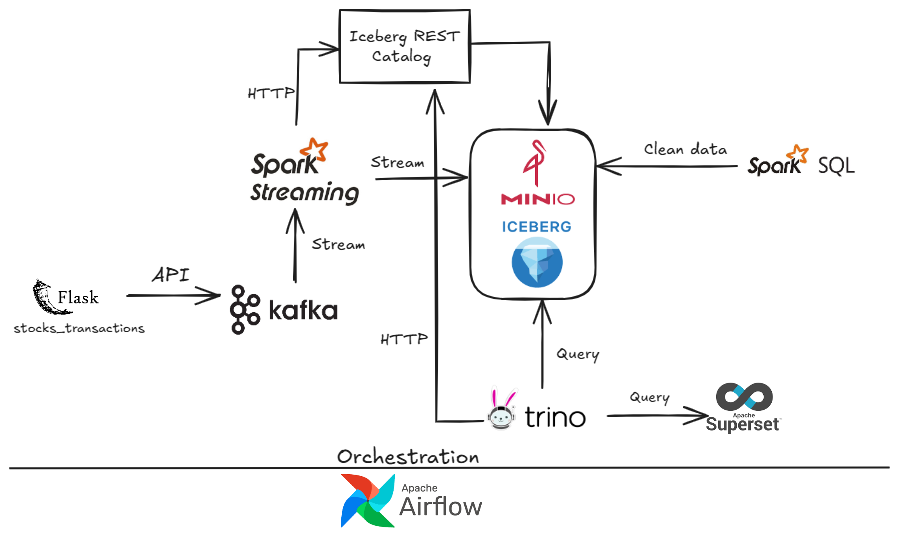
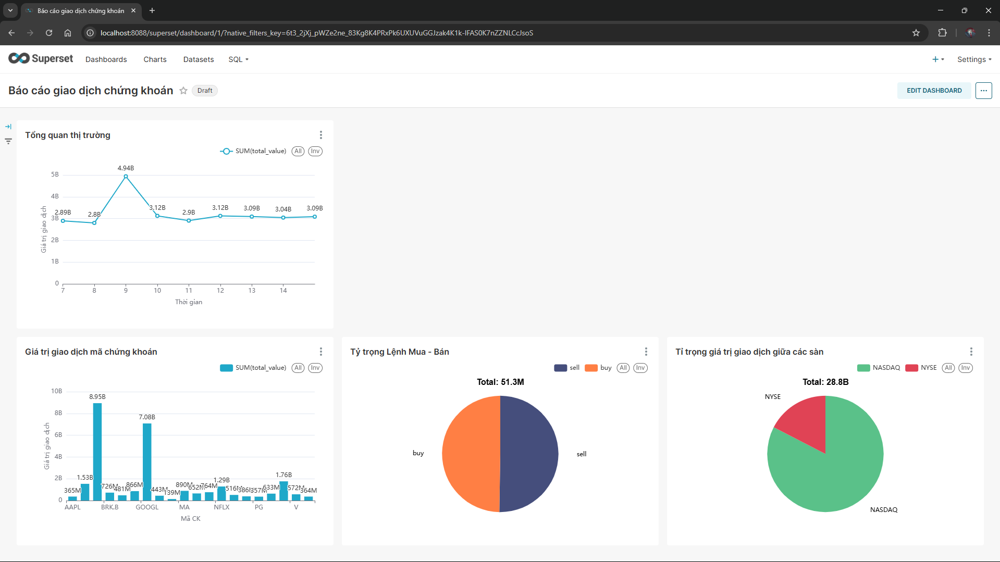
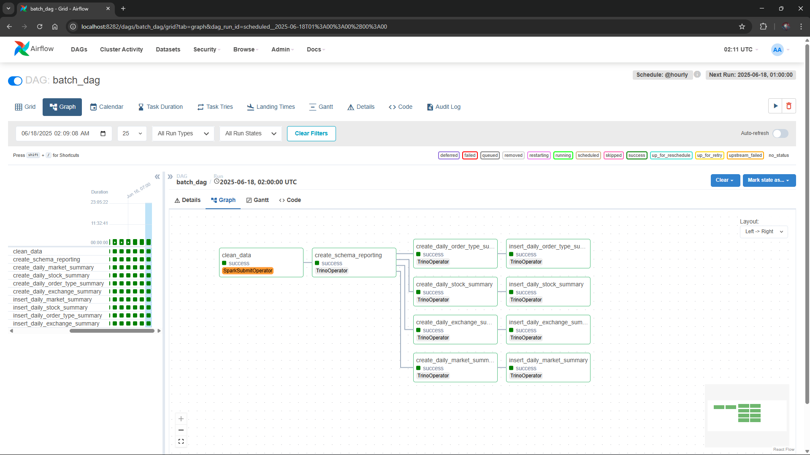

# Stock Stream Lakehouse

[](https://github.com/dungtran174/stock-stream-lakehouse/actions/workflows/lint.yml)
[](https://www.docker.com/)
[](https://kafka.apache.org/)
[](https://spark.apache.org/)
[](https://iceberg.apache.org/)
[](https://trino.io/)
[](https://airflow.apache.org/)
[](https://superset.apache.org/)

An enterprise-grade, end-to-end **Streaming Data Lakehouse** pipeline simulating stock market transactions. Built with **Kafka (KRaft)**, **PySpark Structured Streaming**, **Apache Iceberg**, **MinIO**, **Trino**, **Apache Airflow**, and **Apache Superset** running in a fully containerized Docker environment.

---

## Table of Contents
- [Objective](#objective)
- [Architecture Diagram](#architecture-diagram)
- [Medallion Lakehouse Design](#medallion-lakehouse-design)
- [Final Results](#final-results)
- [Technologies Used](#technologies-used)
- [Quickstart Guide](#quickstart-guide)
- [Detailed Setup Guides](#detailed-setup-guides)
- [Services & Port Mapping](#services--port-mapping)
- [Engineering Highlights](#engineering-highlights)
- [Future Enhancements](#future-enhancements)

---

## Objective

In modern financial markets, millions of stock transaction events are generated continuously across multiple exchanges (HOSE, HNX, UPCOM). Traditional batch architectures create substantial analytical latency, while pure streaming architectures struggle with complex historical joins and ACID consistency.

**Stock Stream Lakehouse** solves this by implementing a unified **Lambda/Medallion Architecture**:
1. **Real-time Ingestion**: Stock events are fetched from a REST API and streamed through Apache Kafka (in KRaft mode).
2. **Stream Sink to Lakehouse**: PySpark Structured Streaming processes raw events and sinks them directly into Apache Iceberg tables backed by MinIO (S3-compatible object storage).
3. **Batch Quality & Deduplication**: Hourly PySpark batch jobs cleanse corrupt records, remove duplicates via window functions, and promote data to the Silver layer.
4. **Interactive Analytics & BI**: Trino acts as the distributed SQL query engine, running high-performance queries on Iceberg metadata to aggregate market metrics into the Gold layer and power Apache Superset dashboards.
5. **End-to-End Orchestration**: Apache Airflow automates both real-time streaming ingestion and hourly batch ETL pipelines.

---

## Architecture Diagram



### Data Pipeline Flow:
```text
[ Data Generator ] ──► [ Flask REST API ] ──► [ Kafka Topic (KRaft) ]
                                                       │
                                                       ▼ (PySpark Streaming)
[ MinIO S3 Storage ] ◄── [ Iceberg REST Catalog ] ◄────┘
         │
         ├─► Bronze Layer: iceberg.stocks.transactions (Raw Parquet)
         │        │
         │        ▼ (Hourly PySpark Cleansing & Deduplication)
         ├─► Silver Layer: iceberg.stocks.transactions_cleaned
         │        │
         │        ▼ (Hourly Trino SQL Aggregation)
         └─► Gold Layer: iceberg.stocks_reporting (Data Mart)
                  │
                  ▼ (SQLAlchemy-Trino)
        [ Apache Superset Dashboard ]
```

---

## Medallion Lakehouse Design

| Layer | Table Name | Storage Format | Partitioning | Description |
| :--- | :--- | :--- | :--- | :--- |
| **Bronze** | `iceberg.stocks.transactions` | Parquet / Iceberg | `[ts_year, ts_month, ts_day]` | Append-only raw streaming ingestion from Kafka. Preserves raw payload for auditing and re-processing. |
| **Silver** | `iceberg.stocks.transactions_cleaned` | Parquet / Iceberg | `[ts_year, ts_month, ts_day]` | Cleaned records with validated data types, removed nulls/NaNs, and window-based transaction deduplication. |
| **Gold** | `iceberg.stocks_reporting.daily_market_summary`<br>`daily_stock_summary`<br>`daily_order_type_summary`<br>`daily_exchange_summary` | Parquet / Iceberg | `[year, month]` | Aggregated reporting data mart optimized for analytical queries, business KPIs, and Superset BI dashboards. |

---

## Final Results

### 1. Superset Executive BI Dashboard
Interactive analytical dashboard tracking trading volume, monetary value, ticker movements, and order types:


### 2. Airflow DAG Orchestration
Automated daily streaming and hourly batch pipelines with dependency management:


---

## Technologies Used

| Tool / Technology | Category | Purpose |
| :--- | :--- | :--- |
| **[Apache Kafka](https://kafka.apache.org/)** | Streaming Message Broker | Ingestion buffer running in KRaft mode (no ZooKeeper dependency). |
| **[Apache Spark](https://spark.apache.org/)** | Distributed Processing Engine | PySpark Structured Streaming for real-time sink and Batch for Silver cleansing. |
| **[Apache Iceberg](https://iceberg.apache.org/)** | Lakehouse Table Format | ACID transactions, schema evolution, hidden partitioning, and time travel. |
| **[MinIO](https://min.io/)** | Object Storage | S3-compatible, high-performance distributed object storage. |
| **[Trino](https://trino.io/)** | Distributed Query Engine | Fast ANSI SQL query coordinator for federated queries over Iceberg tables. |
| **[Apache Airflow](https://airflow.apache.org/)** | Workflow Orchestrator | Schedules streaming tasks, batch cleaning, and Trino aggregation steps. |
| **[Apache Superset](https://superset.apache.org/)** | Business Intelligence (BI) | Data exploration, SQL Lab queries, and interactive reporting dashboards. |
| **[Docker & Compose](https://www.docker.com/)** | Containerization | Modular, one-command deployment across a unified bridge network. |

---

## Quickstart Guide

### Prerequisites
- [Docker](https://docs.docker.com/get-docker/) (>= 24.0) and [Docker Compose](https://docs.docker.com/compose/install/) (>= 2.0)
- Make utility (`sudo apt-get install make`)
- Recommended: At least 8GB RAM allocated to Docker.

### 1. Clone the Repository
```bash
git clone https://github.com/dungtran174/stock-stream-lakehouse.git
cd stock-stream-lakehouse
```

### 2. Start the Lakehouse Infrastructure
Spin up Kafka, MinIO, Iceberg REST, Spark Master/Worker, Trino, Superset, and Airflow:
```bash
make infra-up
```

### 3. Bootstrap Superset
Initialize the Superset metadata database and default admin account (`admin` / `admin`):
```bash
make superset-init
```

### 4. Initialize Airflow & Trigger Pipelines
Start Airflow services and configure connections:
```bash
make airflow-init
```
1. Open Airflow at [http://localhost:8282](http://localhost:8282) (login: `admin` / `admin`).
2. Add connections `spark_conn` and `trino_conn` (see [Airflow Setup Guide](setup/airflow.md)).
3. Enable and trigger `stream_dag` to start Kafka ingestion and Spark Streaming.
4. Trigger `batch_dag` to run Silver cleansing and Gold Trino aggregations.

### 5. Explore BI Dashboards
Open Superset at [http://localhost:8088](http://localhost:8088) to query Gold tables or view dashboards (see [Superset Setup Guide](setup/superset.md)).

### 6. Teardown
```bash
make infra-down
```

---

## Detailed Setup Guides

Modular setup, operational, and troubleshooting documentation inspired by enterprise standards:

- [**End-to-End Architecture Deep Dive**](setup/architecture.md): Detailed pipeline mechanics and data flow.
- [**Services, Ports & Credentials**](setup/services.md): Complete port mappings, UI URLs, and default credentials.
- [**Apache Kafka & Broker Guide**](setup/kafka.md): KRaft cluster architecture, topic schemas, and Kafka UI monitoring.
- [**Apache Spark & PySpark Guide**](setup/spark.md): Cluster setup, Iceberg REST integration, and streaming/batch jobs.
- [**Trino Distributed Query Engine**](setup/trino.md): Catalog configuration, ANSI SQL queries, and Iceberg metadata inspection.
- [**MinIO S3 Storage & Warehouse**](setup/minio.md): S3 object storage setup, bucket provisioning, and directory layout.
- [**Airflow Orchestration Guide**](setup/airflow.md): Connection setup, DAG graphs, and task dependencies.
- [**Apache Superset BI Guide**](setup/superset.md): Trino connection URI, SQL Lab queries, and dashboard creation.
- [**Troubleshooting & Debug Guide**](setup/debug.md): Practical diagnostics for ports, memory limits, and network errors.

---

## Services & Port Mapping

| Service | Host Port | Web UI URL | Default Credentials |
| :--- | :--- | :--- | :--- |
| **Airflow Webserver** | `8282` | [http://localhost:8282](http://localhost:8282) | `admin` / `admin` |
| **Apache Superset** | `8088` | [http://localhost:8088](http://localhost:8088) | `admin` / `admin` |
| **Trino Coordinator** | `8383` | [http://localhost:8383](http://localhost:8383) | `admin` |
| **MinIO Console** | `9001` | [http://localhost:9001](http://localhost:9001) | `admin` / `password` |
| **Kafka UI** | `8080` | [http://localhost:8080](http://localhost:8080) | - |
| **Spark Master UI** | `8081` | [http://localhost:8081](http://localhost:8081) | - |
| **Flask Ingestion API** | `5000` | [http://localhost:5000](http://localhost:5000) | - |

*(For full details, see [setup/services.md](setup/services.md))*

---

## Engineering Highlights

- **Kafka KRaft Mode**: Modern Kafka deployment removing the ZooKeeper dependency for simplified operational overhead.
- **Partition Pruning**: Tables in Iceberg are partitioned on transaction date `[ts_year, ts_month, ts_day]`, dramatically speeding up hourly batch scans and reducing query cost.
- **Data Quality & Deduplication**: Silver batch job uses PySpark Window functions (`ROW_NUMBER() OVER (PARTITION BY transaction_id ORDER BY ts DESC)`) to eliminate duplicate streaming messages.
- **CI/CD Quality Control**: GitHub Actions workflow (`.github/workflows/lint.yml`) runs `flake8` and code quality linting on every push and pull request.
- **Makefile Automation**: Declarative CLI commands for common operations (`make infra-up`, `make superset-init`, `make clean`).

---

## Future Enhancements
- [ ] Implement dbt-trino for declarative transformations in the Gold layer.
- [ ] Add Great Expectations or Soda Core for automated data quality assertions in Airflow.
- [ ] Deploy streaming jobs using Apache Flink for sub-second streaming transformation.
- [ ] Add Terraform scripts for AWS / GCP cloud deployment.

---

## Author
- **Dung Tran** - [GitHub Profile](https://github.com/dungtran174)
