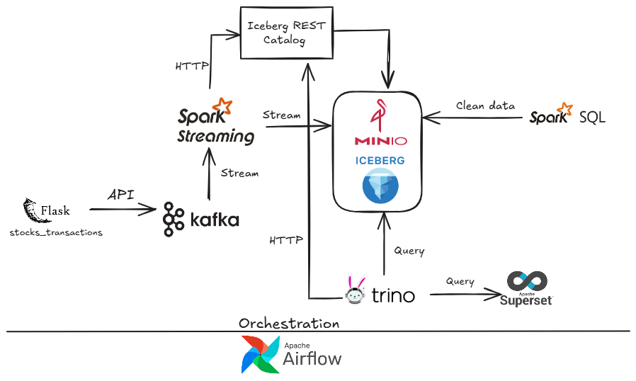

# Stock Stream Lakehouse

Hệ thống Streaming Data Lakehouse thu thập, xử lý và phân tích giao dịch chứng khoán theo thời gian thực dựa trên kiến trúc Medallion (Bronze → Silver → Gold).

---

## 1. Giới thiệu & Bài toán giải quyết

### Xây dựng pipeline dữ liệu Lakehouse End-to-End:
- **Thu thập:** Sinh và đẩy dữ liệu giao dịch chứng khoán (HOSE, HNX, UPCOM) qua REST API vào **Kafka (KRaft)**.
- **Xử lý Real-time & Batch:** Sử dụng **PySpark Structured Streaming** ghi trực tiếp vào **Apache Iceberg**, kết hợp PySpark batch định kỳ làm sạch, khử trùng lặp và tổng hợp số liệu thị trường vào Gold Mart bằng **Trino SQL**.
- **Phục vụ BI:** Trực quan hóa biến động giá, khối lượng giao dịch và phân tích lệnh qua **Apache Superset**.
- **Điều phối:** Tự động hóa toàn bộ luồng streaming và batch với **Apache Airflow**.

### Giải quyết vấn đề
- **Giảm độ trễ phân tích:** Kết hợp streaming để ghi nhận biến động tức thì và batch để tổng hợp lịch sử mà không cần chờ ETL cuối ngày.
- **Đảm bảo tính nhất quán (ACID):** Định dạng bảng mở **Apache Iceberg** hỗ trợ ACID transaction, time travel, phân vùng ẩn (hidden partitioning) và loại bỏ lỗi ghi trùng lặp.
- **Tối ưu chi phí & mở rộng:** Lưu trữ phân tán trên **MinIO (S3)**, truy vấn phân tán tốc độ cao với **Trino** thay vì duy trì kho dữ liệu đắt đỏ.

---

## 2. Kiến trúc hệ thống



```text
[ Data Generator ] ──► [ Flask REST API ] ──► [ Kafka Topic (KRaft) ]
                                                       │
                                                       ▼ (PySpark Streaming)
[ MinIO S3 Storage ] ◄── [ Iceberg REST Catalog ] ◄────┘
         │
         ├─► Bronze Layer: iceberg.stocks.transactions (Raw Parquet)
         │        │
         │        ▼ (PySpark Cleansing & Deduplication)
         ├─► Silver Layer: iceberg.stocks.transactions_cleaned
         │        │
         │        ▼ (Trino SQL Aggregation)
         └─► Gold Layer: iceberg.stocks_reporting (Data Mart) ──► [ Apache Superset Dashboard ]
```

- **Broker:** Apache Kafka (KRaft mode).
- **Storage & Table Format:** MinIO (S3-compatible) + Apache Iceberg (REST Catalog).
- **Processing:** PySpark (Structured Streaming + Batch).
- **Serving & BI:** Trino (MPP Query Engine) + Apache Superset.
- **Orchestration:** Apache Airflow.

---

## 3. Hướng dẫn chạy dự án

### Yêu cầu
- Docker >= 24.0 & Docker Compose >= 2.0
- RAM tối thiểu: 8GB
- Make (tùy chọn)

### Các bước khởi chạy

```bash
# 1. Clone repository
git clone https://github.com/dungtran174/stock-stream-lakehouse.git
cd stock-stream-lakehouse

# 2. Khởi chạy toàn bộ hạ tầng (Kafka, MinIO, Spark, Trino, Superset, Airflow)
make infra-up

# 3. Khởi tạo Superset (tạo tài khoản admin/admin & cấu hình ban đầu)
make superset-init

# 4. Khởi tạo Airflow & kích hoạt pipeline
make airflow-init
```

1. Mở Airflow tại [http://localhost:8282](http://localhost:8282) (`admin` / `admin`).
2. Bật và trigger `stream_dag` để bắt đầu stream dữ liệu từ Kafka vào Iceberg Bronze.
3. Trigger `batch_dag` để chạy làm sạch (Silver) và tổng hợp số liệu (Gold).
4. Mở Superset tại [http://localhost:8088](http://localhost:8088) (`admin` / `admin`) để xem dashboard.

Dừng hệ thống khi không sử dụng:
```bash
make infra-down
```

---

## 4. Dịch vụ & Cổng truy cập

| Dịch vụ | URL | Tài khoản mặc định | Mô tả |
| :--- | :--- | :--- | :--- |
| **Apache Airflow** | `http://localhost:8282` | `admin` / `admin` | Quản lý & điều phối DAGs |
| **Apache Superset** | `http://localhost:8088` | `admin` / `admin` | Dashboard BI & SQL Lab |
| **Trino Coordinator** | `http://localhost:8383` | `admin` | Truy vấn phân tán qua Iceberg |
| **MinIO Console** | `http://localhost:9001` | `admin` / `password` | Quản lý S3 bucket & data files |
| **Kafka UI** | `http://localhost:8080` | - | Giám sát Kafka topics |
| **Spark Master UI** | `http://localhost:8081` | - | Giám sát cụm Spark |
| **Flask API** | `http://localhost:5000` | - | Endpoint nhận event dữ liệu |
