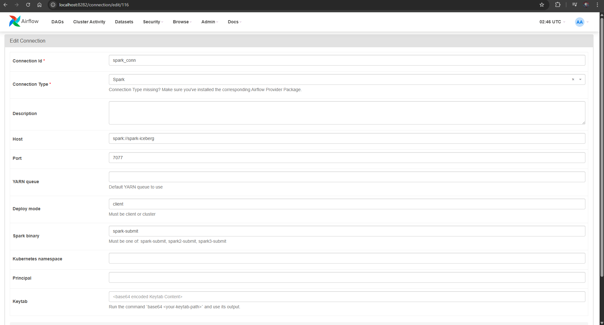
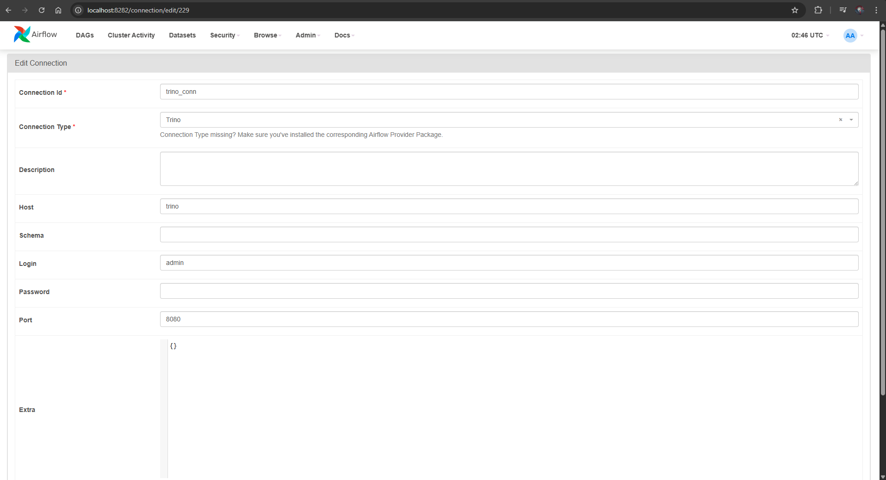

# Airflow Setup and Orchestration Guide

Apache Airflow is the central orchestrator of the Stock Stream Lakehouse, scheduling streaming ingestion, batch data quality cleansing, and analytical aggregations into the reporting data mart.

---

## 1. Starting Airflow

Start the Airflow Postgres metadata database, Webserver, and Scheduler:

```bash
make airflow-init
```

To follow logs:
```bash
make airflow-logs
```

The Web UI is accessible at:
- **URL:** [http://localhost:8282](http://localhost:8282)
- **Username:** `admin`
- **Password:** `admin`

---

## 2. Configuring Airflow Connections

Before triggering DAGs, create two connections in the Airflow Web UI:

### A. Spark Connection (`spark_conn`)
Enables `SparkSubmitOperator` to deploy PySpark jobs to the Spark Master container:

1. Navigate to **Admin** -> **Connections** -> click **+** (Add a new record).
2. Configure the connection fields:
   - **Connection Id:** `spark_conn`
   - **Connection Type:** `Spark`
   - **Host:** `spark-iceberg`
   - **Port:** `7077`
3. Click **Save**.



### B. Trino Connection (`trino_conn`)
Enables `TrinoOperator` to execute DDL queries and dimensional aggregations:

1. Navigate to **Admin** -> **Connections** -> click **+** (Add a new record).
2. Configure the connection fields:
   - **Connection Id:** `trino_conn`
   - **Connection Type:** `Trino`
   - **Host:** `trino`
   - **Port:** `8080`
   - **Schema:** `stocks`
   - **Login:** `admin`
3. Click **Save**.



---

## 3. DAG Workflows

The repository contains two production DAGs under `airflow/dags/`:


### A. `stream_dag` (Real-Time Ingestion)
- **Schedule:** `@daily` (or triggered on-demand).
- **Tasks:**
  1. `stream_from_api_to_kafka_task` (`PythonOperator`):
     - Paginates and fetches transactions from the Flask API (`flask-api:5000/api/get_data`).
     - Publishes JSON messages to the daily Kafka topic (`stock_transactions_YYYY_M_D`).
  2. `submit_kafka_to_iceberg_job` (`SparkSubmitOperator`):
     - Launches `spark/code/stream_kafka_iceberg.py`.
     - Streams records from Kafka and sinks into the Bronze Iceberg table (`iceberg.stocks.transactions`).

### B. `batch_dag` (Hourly Batch Lakehouse Pipeline)
- **Schedule:** `@hourly`.
- **Tasks & Lineage:**
  ```text
  clean_data (SparkSubmitOperator: Bronze -> Silver)
       │
       ▼
  create_schema_reporting (TrinoOperator: CREATE SCHEMA)
       │
       ├─► create_daily_market_summary   ──► insert_daily_market_summary
       ├─► create_daily_stock_summary    ──► insert_daily_stock_summary
       ├─► create_daily_order_type_summary ──► insert_daily_order_type_summary
       └─► create_daily_exchange_summary ──► insert_daily_exchange_summary
  ```
- **Execution Flow:**
  1. `clean_data`: Runs PySpark script `spark/code/clean_data.py` to remove nulls, validate transaction schemas, deduplicate records via Window functions, and overwrite into Silver layer (`iceberg.stocks.transactions_cleaned`).
  2. `create_schema_reporting`: Ensures `iceberg.stocks_reporting` schema exists.
  3. `create_daily_*`: Idempotently defines partitioned reporting summary tables.
  4. `insert_daily_*`: Aggregates trading volumes, transaction counts, and monetary value by day, stock, order type, and exchange into the Gold layer.

---

## 4. Monitoring & Troubleshooting

```bash
# Check running DAG runs and task instances
docker-compose exec webserver airflow dags list
docker-compose exec webserver airflow tasks list batch_dag

# Manually trigger batch_dag
docker-compose exec webserver airflow dags trigger batch_dag
```
