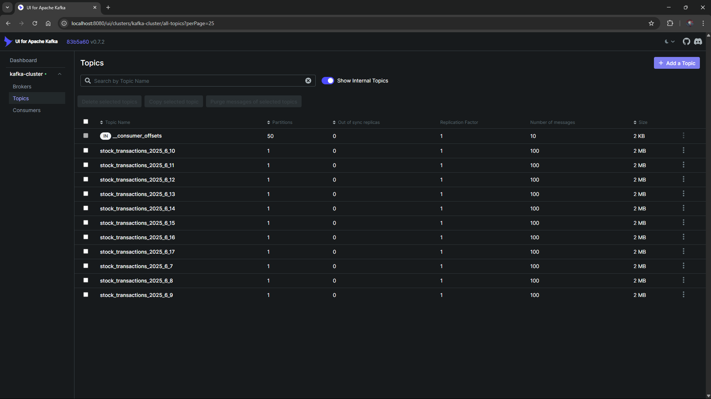

# Apache Kafka & Message Broker Guide

This document details the configuration, management, and monitoring of Apache Kafka within the Stock Stream Lakehouse architecture.



---

## 1. Architecture: Kafka with KRaft Mode

Unlike legacy Kafka deployments that depend on Apache ZooKeeper, this project deploys Kafka in **KRaft (Kafka Raft Metadata) mode** using Confluent Community Server 7.5.1:
- **No ZooKeeper Overhead:** Faster metadata propagation and streamlined container maintenance.
- **Single Node Controller & Broker:** `KAFKA_PROCESS_ROLES: 'broker,controller'` simplifies local development while preserving production-style event schemas.
- **Cluster ID:** Formatted automatically via fixed GUID (`ZWe3nnZwTrKSM0aM2doAxQ`).

---

## 2. Ports and Listeners

Kafka is configured with multi-listener support:
- **Host Listener (External):** `PLAINTEXT_HOST://0.0.0.0:9092` (maps to `localhost:9092` for scripts running on the host).
- **Docker Network Listener (Internal):** `PLAINTEXT://broker:29092` (used by Flask API, Spark Streaming, and Airflow containers).
- **Controller Listener:** `CONTROLLER://broker:29093` for KRaft consensus.

---

## 3. Topic Architecture & Partitioning

Topics are partitioned dynamically by trading date to match the Lakehouse partitioning strategy:
- **Topic Naming Convention:** `stock_transactions_<YEAR>_<MONTH>_<DAY>` (e.g., `stock_transactions_2025_6_10`).
- **Replication Factor:** `1` (single-node development cluster).
- **Message Key:** Combined year, month, day, and pagination offset (`{year}_{month}_{day}_{offset}`).
- **Message Value:** JSON array of stock transaction events.

### Sample Event Schema:
```json
{
  "transaction_id": "TXN_20250610_000001",
  "ts": "2025-06-10 09:30:15",
  "stock_symbol": "VNM",
  "price": 68.5,
  "quantity": 1500,
  "order_type": "BUY",
  "exchange": "HOSE"
}
```

---

## 4. Testing Message Production

A test script is included under `kafka/` to verify broker connectivity without running Airflow:

```bash
# Run local test producer from repository root
python3 kafka/test_producer.py
```

To test message publishing directly inside the container network:
```bash
docker-compose exec flask-api python3 -c "
from confluent_kafka import Producer
p = Producer({'bootstrap.servers': 'broker:29092'})
p.produce('test_topic', key='test_key', value='test_value')
p.flush()
print('Message produced successfully!')
"
```

---

## 5. Monitoring Topics via Kafka UI

Provectus Kafka UI is exposed at:
- **URL:** [http://localhost:8080](http://localhost:8080)

Key Capabilities:
- **Brokers Dashboard:** Monitor broker status, controller roles, and partitions.
- **Topics Explorer:** Inspect created topics, partition distributions, and consumer group offsets.
- **Message Browser:** View real-time payloads, message timestamps, and payload sizes.
- **Consumer Groups:** Check lag for PySpark streaming consumer groups.
