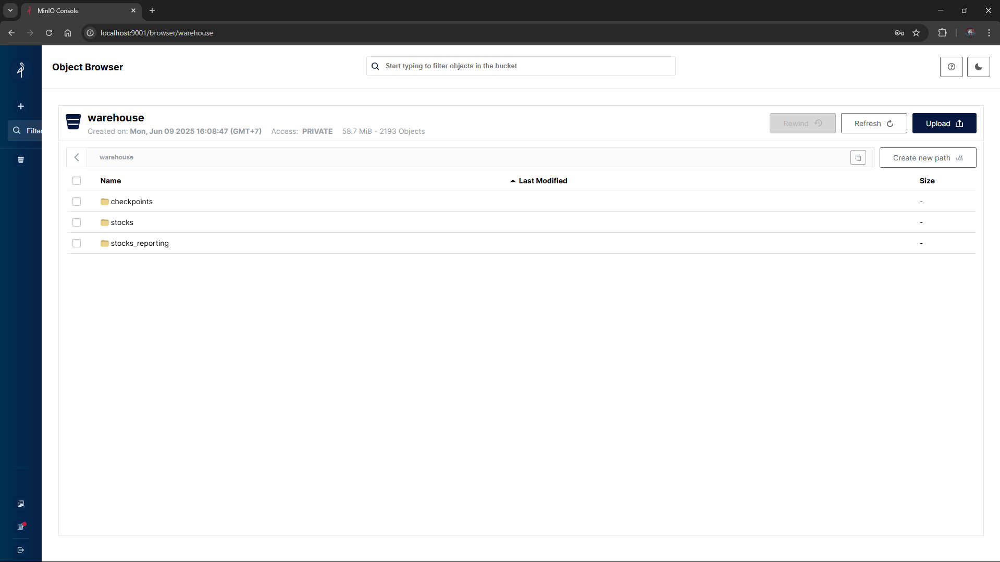

# MinIO Object Storage & Iceberg Warehouse Guide

MinIO provides high-performance, S3-compatible object storage for storing Apache Iceberg data files (Parquet) and metadata files (manifests, snapshot lists).



---

## 1. MinIO Service Overview

- **S3 API Endpoint:** `http://localhost:9000` (internal: `http://minio:9000`)
- **Web Console URL:** [http://localhost:9001](http://localhost:9001)
- **Root User:** `admin`
- **Root Password:** `password`
- **Region:** `us-east-1`
- **Default Warehouse Bucket:** `warehouse`

---

## 2. Automated Bucket Initialization

The `docker-compose.yml` file includes a dedicated initialization service (`mc` - MinIO Client) executing [scripts/init_minio.sh](file:///home/dung/project/streaming_lakehouse/scripts/init_minio.sh):

```bash
#!/bin/sh
until (/usr/bin/mc config host add minio http://minio:9000 admin password) do
    echo '...waiting for minio...'
    sleep 1
done

# Create warehouse bucket if it does not exist
/usr/bin/mc mb --ignore-existing minio/warehouse

# Set public read access for local development
/usr/bin/mc policy set public minio/warehouse

echo "MinIO warehouse bucket initialized successfully!"
```

This ensures that upon running `make infra-up`, the required `warehouse` bucket exists before Spark and Trino attempt to read or write Iceberg data.

---

## 3. Storage Hierarchy in MinIO

Within the `warehouse` bucket, Apache Iceberg organizes data following the standard layout:

```text
warehouse/
├── stocks/
│   ├── transactions/
│   │   ├── metadata/
│   │   │   ├── v1.metadata.json
│   │   │   ├── snap-*.avro
│   │   │   └── *.manifest.avro
│   │   └── data/
│   │       ├── ts_year=2025/
│   │       │   └── ts_month=6/
│   │       │       └── ts_day=10/
│   │       │           └── *.parquet
│   └── transactions_cleaned/
│       ├── metadata/
│       └── data/
└── stocks_reporting/
    ├── daily_market_summary/
    ├── daily_stock_summary/
    ├── daily_order_type_summary/
    └── daily_exchange_summary/
```

---

## 4. Useful `mc` CLI Commands

Interact with MinIO directly via the `mc` container:

```bash
# List all buckets
docker exec -it mc mc ls minio/

# List files inside the warehouse bucket
docker exec -it mc mc ls minio/warehouse/stocks/

# Check storage disk usage
docker exec -it mc mc du minio/warehouse/
```
