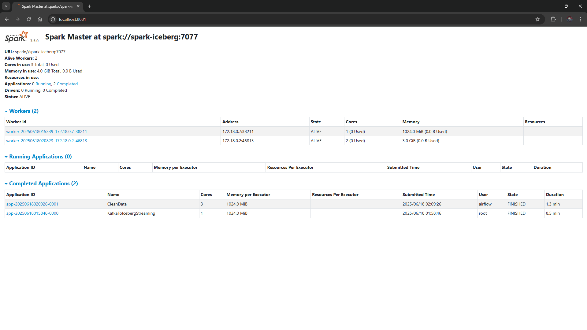

# Apache Spark & PySpark Processing Guide

Apache Spark 3.5.0 provides distributed compute for both real-time stream ingestion and hourly batch data transformations on Apache Iceberg.



---

## 1. Spark Cluster Architecture

The environment deploys a distributed Spark cluster running `tabulario/spark-iceberg:3.5.0_1.4.2`:
- **Master Node (`spark-iceberg`):**
  - Web UI: [http://localhost:8081](http://localhost:8081)
  - RPC Port: `7077`
  - Internal Address: `spark-iceberg:7077`
- **Worker Node (`spark-worker-1`):**
  - Web UI: [http://localhost:8082](http://localhost:8082)
  - Resources Allocated: 2 CPU cores, 3GB RAM.
- **REST Catalog Connection:** Connects to `http://iceberg-rest:8181` to manage table metadata and schema evolution.

---

## 2. Configuration: `spark-defaults.conf`

The file [spark/conf/spark-defaults.conf](file:///home/dung/project/streaming_lakehouse/spark/conf/spark-defaults.conf) configures the Iceberg catalog and S3 storage:

```properties
# Iceberg REST Catalog Setup
spark.sql.extensions                   org.apache.iceberg.spark.extensions.IcebergSparkSessionExtensions
spark.sql.catalog.iceberg              org.apache.iceberg.spark.SparkCatalog
spark.sql.catalog.iceberg.type         rest
spark.sql.catalog.iceberg.uri          http://iceberg-rest:8181
spark.sql.catalog.iceberg.io-impl      org.apache.iceberg.aws.s3.S3FileIO
spark.sql.catalog.iceberg.warehouse    s3://warehouse/

# S3A / MinIO Configuration
spark.sql.catalog.iceberg.s3.endpoint  http://minio:9000
spark.sql.catalog.iceberg.s3.path-style-access true
spark.sql.defaultCatalog               iceberg
spark.hadoop.fs.s3a.endpoint           http://minio:9000
spark.hadoop.fs.s3a.access.key         admin
spark.hadoop.fs.s3a.secret.key         password
spark.hadoop.fs.s3a.path.style.access  true
spark.hadoop.fs.s3a.impl               org.apache.hadoop.fs.s3a.S3AFileSystem
```

---

## 3. Streaming Pipeline: Kafka to Iceberg Bronze

The streaming job is located at [spark/code/stream_kafka_iceberg.py](file:///home/dung/project/streaming_lakehouse/spark/code/stream_kafka_iceberg.py).

### Key Processing Steps:
1. **Source:** Subscribes to Kafka topic pattern `stock_transactions_.*`.
2. **Parsing:** Extracts the JSON payload using an explicit schema (`transaction_id`, `ts`, `stock_symbol`, `price`, `quantity`, `order_type`, `exchange`).
3. **Partition Enrichment:** Derives `ts_year`, `ts_month`, `ts_day` from the event timestamp `ts`.
4. **Sink:** Writes to `iceberg.stocks.transactions` in micro-batches using `.trigger(processingTime="10 seconds")`.
5. **Checkpointing:** Maintains checkpoint state in `/home/iceberg/warehouse/checkpoints/` to ensure at-least-once delivery.

---

## 4. Batch Pipeline: Silver Cleansing & Deduplication

The batch cleansing job is located at [spark/code/clean_data.py](file:///home/dung/project/streaming_lakehouse/spark/code/clean_data.py).

### Key Transformations:
1. **Filtering:** Removes corrupted records where `price`, `quantity`, `order_type`, or `exchange` contain nulls or `"NaN"` strings.
2. **Window-based Deduplication:**
   ```python
   window_spec = Window.partitionBy("transaction_id").orderBy(col("ts").desc())
   dedup_df = (
       cleaned_df.withColumn("row_num", row_number().over(window_spec))
       .filter(col("row_num") == 1)
       .drop("row_num")
   )
   ```
3. **Target Write:** Overwrites the current day partition into the Silver table:
   ```python
   dedup_df.writeTo("iceberg.stocks.transactions_cleaned").overwritePartitions()
   ```

---

## 5. Manual Execution via Docker

Jobs can be executed manually outside of Airflow for debugging:

### Run Streaming Job:
```bash
docker exec -it spark-iceberg spark-submit \
  --packages org.apache.spark:spark-sql-kafka-0-10_2.12:3.5.0,org.apache.iceberg:iceberg-spark-runtime-3.5_2.12:1.4.2,org.apache.iceberg:iceberg-aws-bundle:1.4.2,org.apache.hadoop:hadoop-aws:3.3.1,com.amazonaws:aws-java-sdk-bundle:1.11.1026 \
  /home/iceberg/code/stream_kafka_iceberg.py
```

### Run Batch Cleansing Job:
```bash
docker exec -it spark-iceberg spark-submit \
  --packages org.apache.iceberg:iceberg-spark-runtime-3.5_2.12:1.4.2,org.apache.iceberg:iceberg-aws-bundle:1.4.2,org.apache.hadoop:hadoop-aws:3.3.1,com.amazonaws:aws-java-sdk-bundle:1.11.1026 \
  /home/iceberg/code/clean_data.py
```
