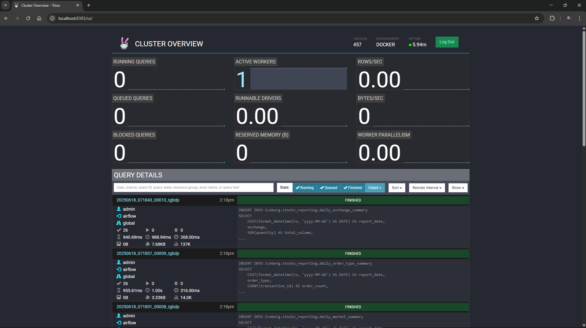

# Trino Distributed SQL Query Engine Guide

Trino 457 acts as the distributed SQL query engine for the Stock Stream Lakehouse, enabling federated ANSI SQL queries across Apache Iceberg tables stored in MinIO.



---

## 1. Trino Architecture & Configuration

Trino runs as a single-node coordinator and worker:
- **Web UI URL:** [http://localhost:8383](http://localhost:8383)
- **Host Port:** `8383` (mapped from container port `8080`).
- **Default User:** `admin` (no password required for local development).

### Catalog Configuration (`trino/catalog/iceberg.properties`):
```properties
connector.name=iceberg
iceberg.catalog.type=rest
iceberg.rest-catalog.uri=http://iceberg-rest:8181
iceberg.rest-catalog.warehouse=s3://warehouse/
iceberg.rest-catalog.security=NONE
iceberg.file-format=PARQUET

# S3 / MinIO Storage Configuration
fs.native-s3.enabled=true
s3.endpoint=http://minio:9000
s3.region=us-east-1
s3.path-style-access=true
s3.aws-access-key=admin
s3.aws-secret-key=password
```

---

## 2. Querying Iceberg Tables via Trino CLI

You can open an interactive SQL session inside the running Trino container:

```bash
docker exec -it trino trino --catalog iceberg --schema stocks
```

### Inspect Schemas & Tables:
```sql
SHOW SCHEMAS;
SHOW TABLES IN stocks;
SHOW TABLES IN stocks_reporting;
```

### Sample Analytical Queries:
```sql
-- Count transactions across layers
SELECT 'Bronze' AS layer, COUNT(*) AS count FROM iceberg.stocks.transactions
UNION ALL
SELECT 'Silver' AS layer, COUNT(*) AS count FROM iceberg.stocks.transactions_cleaned;

-- Inspect daily market aggregations
SELECT * FROM iceberg.stocks_reporting.daily_market_summary ORDER BY report_date DESC LIMIT 5;
```

---

## 3. Querying Iceberg Metadata Tables

Apache Iceberg provides rich internal metadata tables accessible via Trino SQL:

### A. Snapshot History
```sql
SELECT snapshot_id, committed_at, operation, summary
FROM iceberg.stocks."transactions$snapshots"
ORDER BY committed_at DESC;
```

### B. Physical Data Files
```sql
SELECT file_path, file_format, record_count, file_size_in_bytes
FROM iceberg.stocks."transactions$files"
LIMIT 10;
```

### C. Partition Statistics
```sql
SELECT partition, record_count, file_count
FROM iceberg.stocks."transactions$partitions";
```

---

## 4. DDL and Aggregation Scripts

The project maintains version-controlled DDL and reporting aggregation SQL files:
- [trino/sql/create_tables.sql](file:///home/dung/project/streaming_lakehouse/trino/sql/create_tables.sql): Bronze and Silver table definitions.
- [trino/sql/report_tables.sql](file:///home/dung/project/streaming_lakehouse/trino/sql/report_tables.sql): Gold reporting schema, tables, and daily insert queries.
